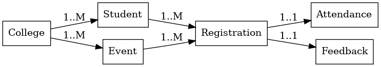
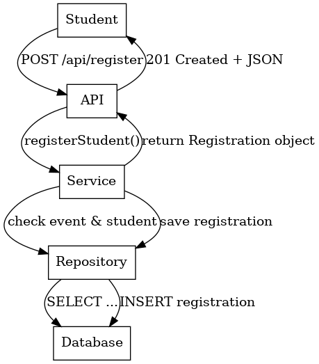
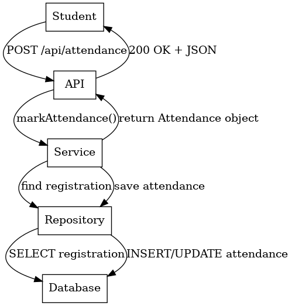
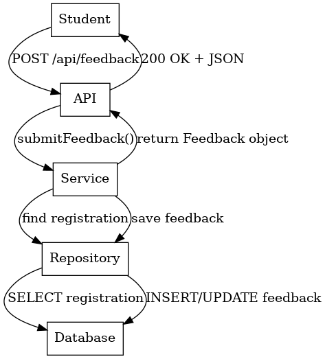

Campus Drive – Design Document
1. Introduction
-> Brief description of the project (Campus Drive Management System).
-> Purpose: Manage colleges, students, events, registrations, attendance, and feedback.

2. System Architecture
-> Architecture overview (Spring Boot application with layered architecture).
-> Layers:
-Controller Layer – Handles API requests (REST endpoints).
-Service Layer – Business logic.
-Repository Layer – Database operations using Spring Data JPA.
-Database Layer – PostgreSQL storing entities.

3. Database Schema
-> Entities: College, Student, Event, Registration, Attendance, Feedback.
-> Relationships explained:
College ↔ Student (1..M)
College ↔ Event (1..M)
Event ↔ Registration (1..M)
Student ↔ Registration (1..M)
Registration ↔ Attendance (1..1)
Registration ↔ Feedback (1..1)
ER Diagram:

4. API Workflows (Sequence Diagrams)
4.1 Student Registration Workflow
-Description of steps (student registers for event).

4.2 Attendance Workflow
-Description of steps (student checks in, system marks attendance).

4.3 Feedback Workflow
-Description of steps (student submits feedback after attending).

5. Key Design Decisions
->Used Spring Boot for rapid development and dependency management.
->Used Spring Data JPA to reduce boilerplate for repositories.
->Database: PostgreSQL (robust and production-ready).
->DTOs used to send/receive clean JSON payloads.
->Chose REST APIs for interoperability.

6. Reports & Analytics
->Event participation count (registrations per event).
->Attendance reports per event/student.
->Average feedback rating per event.

7. Future Improvements
->Authentication & Authorization (Admin vs Student).
->Frontend (React/Angular UI).
->Email/SMS notifications.
->Cloud deployment (Heroku/AWS).
