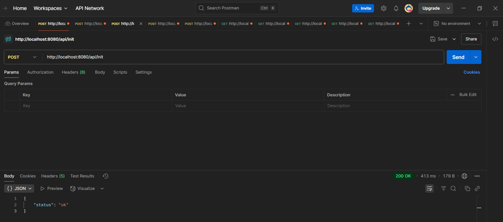
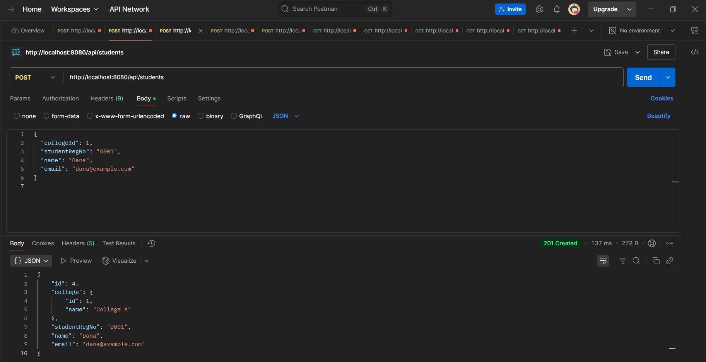
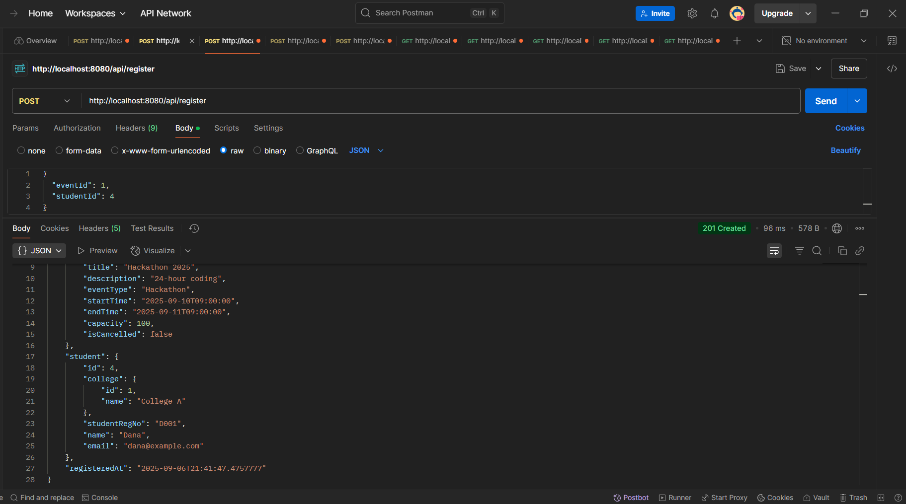
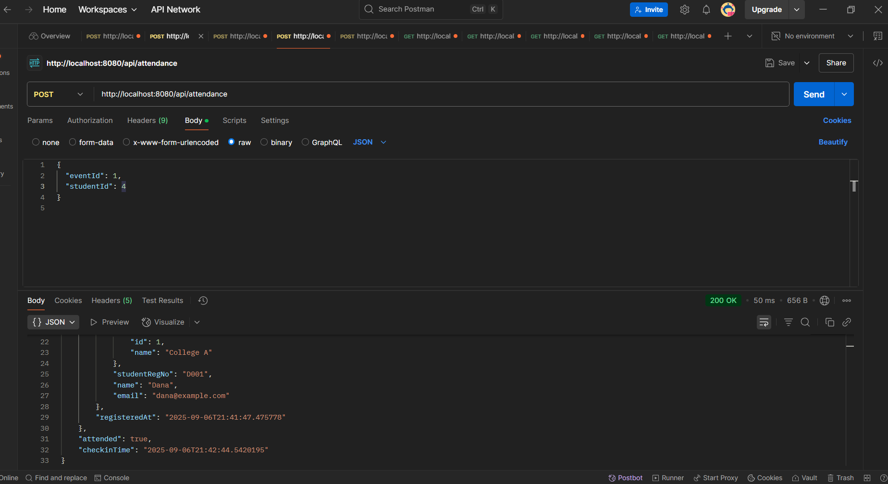
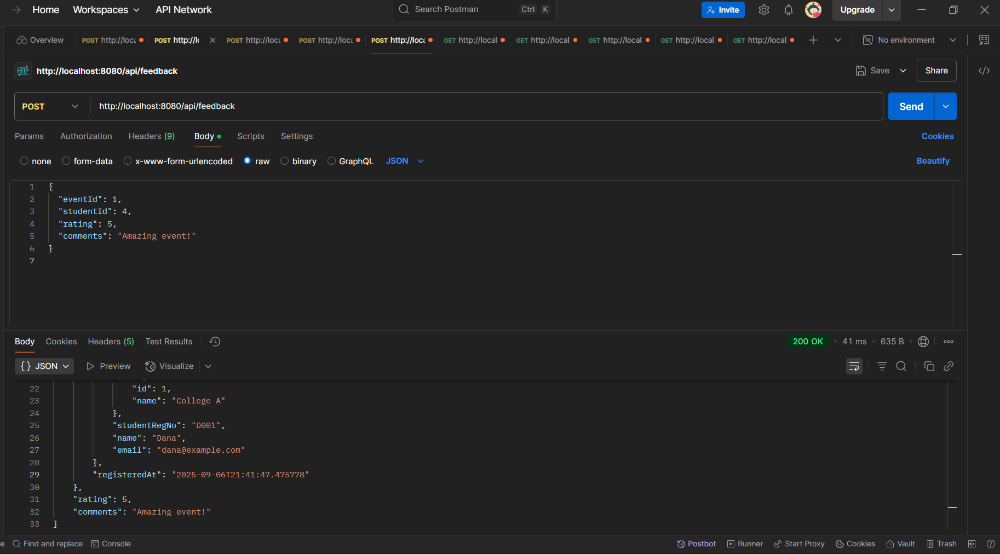
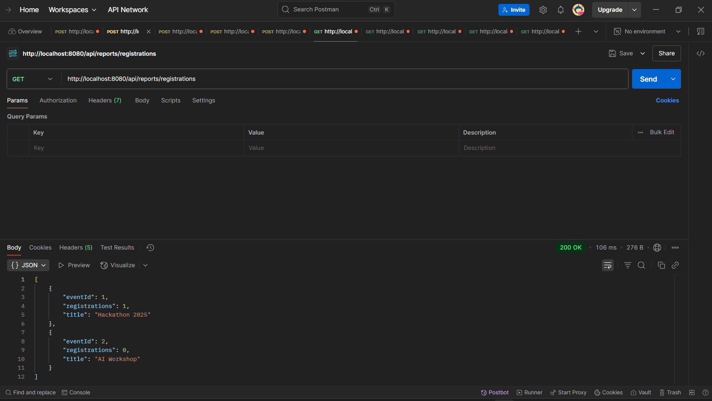
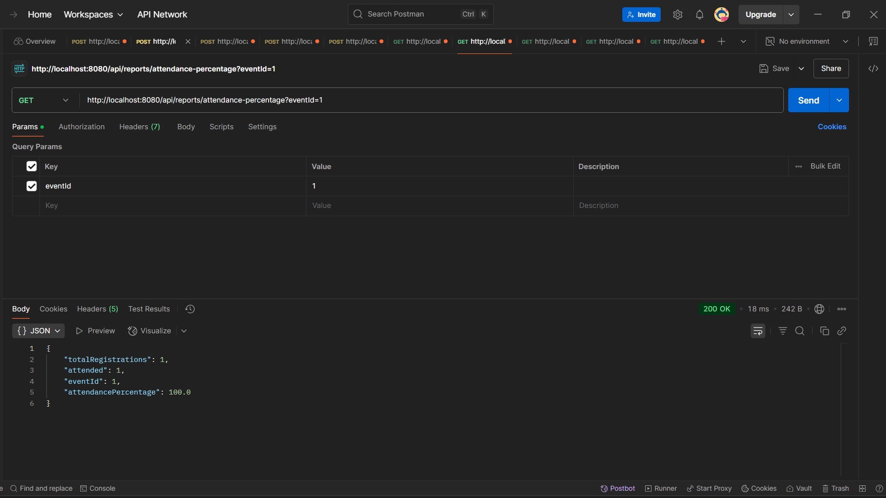
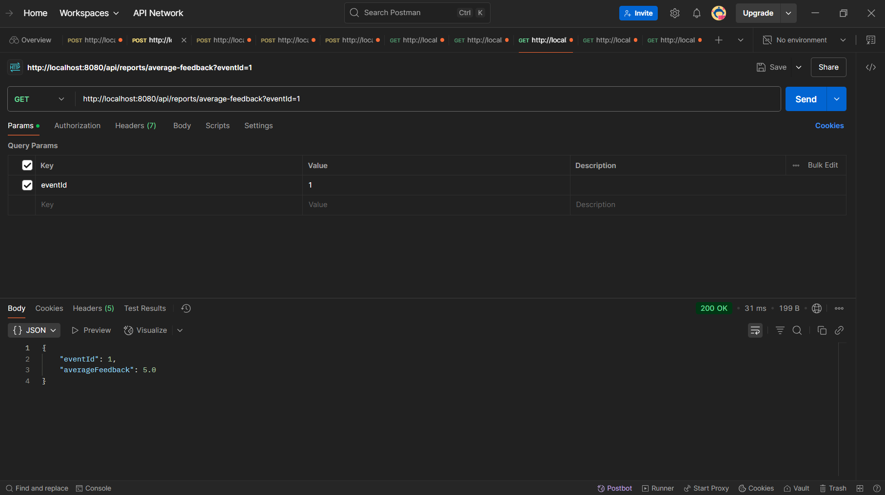
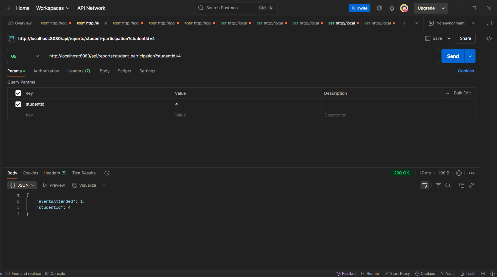
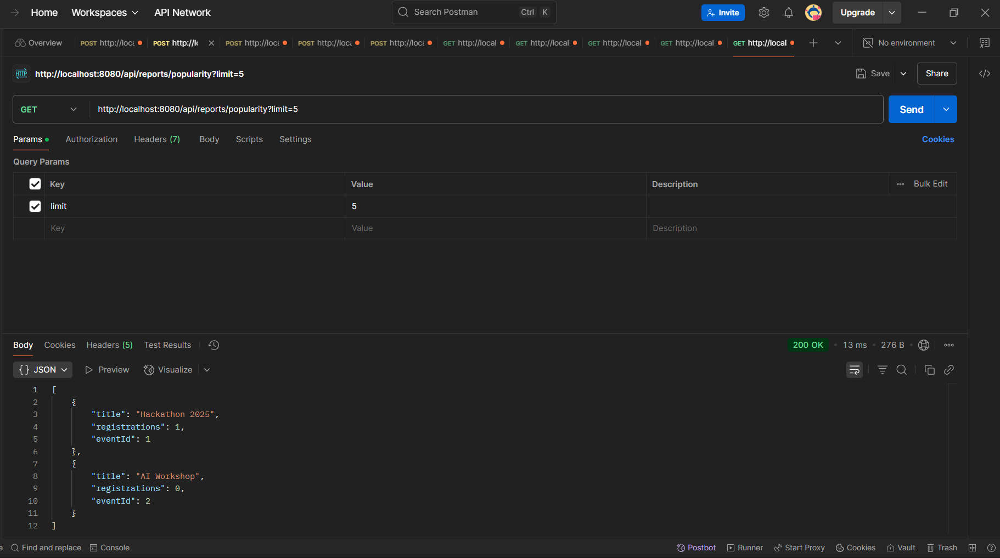

Campus Drive Management System
A Spring Boot + PostgreSQL application for managing campus drive events, registrations, attendance, and feedback, with reporting features.

Features:
1. Manage Colleges, Students, Events
2. Student Registrations for events
3. Attendance Tracking with check-ins
4. Feedback System (rating + comments)
5. Reports: registrations per event, attendance %, feedback, student participation, popularity

Tech Stack:
1. Java 23
2. Spring Boot 3.5.5
3. PostgreSQL 17+
4. Maven for dependency management
5. Postman (API testing)

Setup Instructions
1. Clone Repository
git clone https://github.com/your-username/campusdrive.git
cd campusdrive

2. Configure Database
->Open pgAdmin
->Create the database and user:
   CREATE DATABASE campusdrive;
   CREATE USER campususer WITH PASSWORD 'campuspass';
   GRANT ALL PRIVILEGES ON DATABASE campusdrive TO campususer;

3. Update application.properties
   File: src/main/resources/application.properties
   spring.application.name=campusdrive
   spring.datasource.url=jdbc:postgresql://localhost:5432/campusdrive
   spring.datasource.username=campususer
   spring.datasource.password=campuspass

   spring.jpa.hibernate.ddl-auto=update
   spring.jpa.show-sql=true
   spring.jpa.properties.hibernate.format_sql=true

   server.port=8080

4. Build and Run
   mvn clean install
   mvn spring-boot:run
   App runs at: http://localhost:8080

API Usage(via Postman)
1. Initialize Sample Data
   POST http://localhost:8080/api/init
   Response:
   { "status": "ok" }

2. Add Student
   POST http://localhost:8080/api/students
   Body:
   {
   "college": { "id": 1 },
   "studentRegNo": "D001",
   "name": "Dana",
   "email": "dana@example.com"
   }

3. Register Student for Event
   POST http://localhost:8080/api/register
   Body:
   {
   "eventId": 1,
   "studentId": 4
   }

4. Mark Attendance
   POST http://localhost:8080/api/attendance
   Body:
   {
   "eventId": 1,
   "studentId": 4
   }

5. Submit Feedback
   POST http://localhost:8080/api/feedback
   Body:
   {
   "eventId": 1,
   "studentId": 4,
   "rating": 5,
   "comments": "Amazing event!"
   }

Reports
1. Registrations per Event
   GET http://localhost:8080/api/reports/registrations

2. Attendance Percentage
   GET http://localhost:8080/api/reports/attendance-percentage?eventId=1

3. Average Feedback
   GET http://localhost:8080/api/reports/average-feedback?eventId=1

4. Student Participation
   GET http://localhost:8080/api/reports/student-participation?studentId=4

5. Popular Events
   GET http://localhost:8080/api/reports/popularity?limit=5

Project Structure
campusdrive/
├── src/main/java/com/campusdrive/
│   ├── entity/        # JPA entities
│   ├── repository/    # Repositories
│   ├── service/       # Business logic
│   ├── controller/    # REST controllers
│   └── CampusdriveApplication.java
├── src/main/resources/
│   └── application.properties
├── pom.xml
└── README.md

Future Improvements
1. JWT Authentication for students/organizers
2. Admin Dashboard (React or Angular frontend)
3. CSV/Excel export for reports

Author
G A Sirisha
https://github.com/gasirisha

